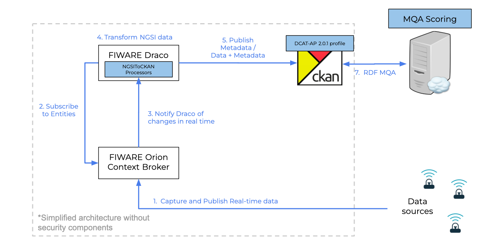
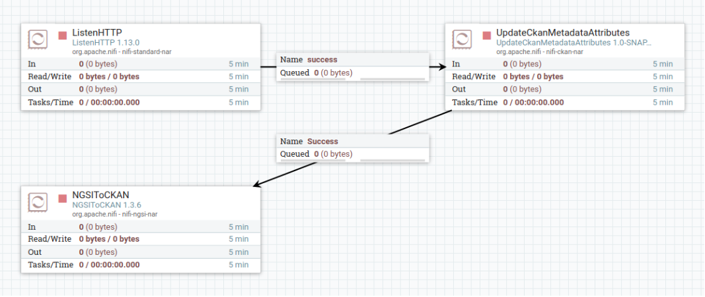
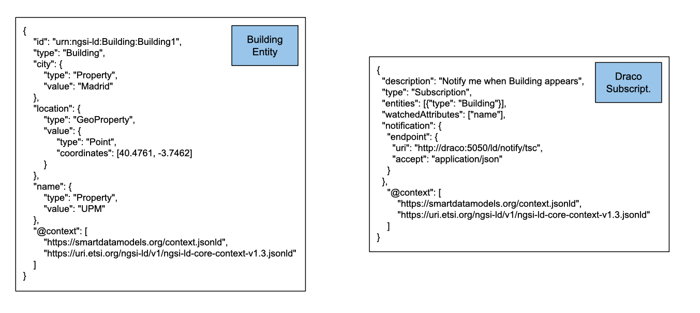
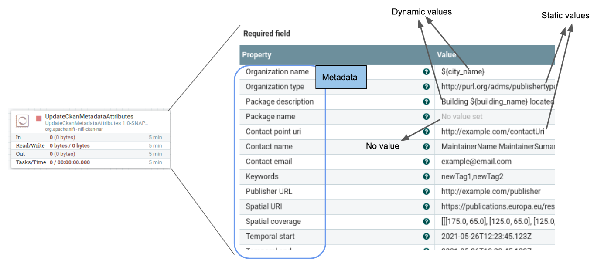
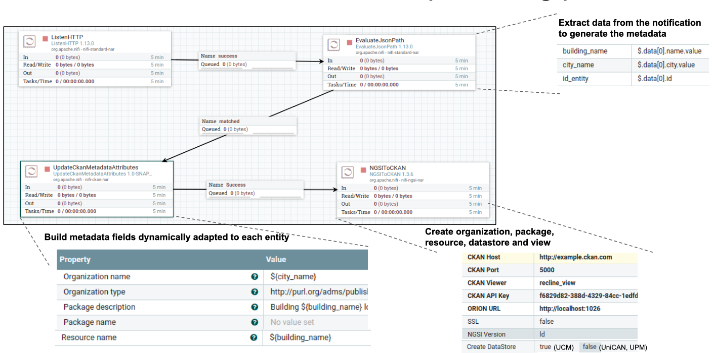
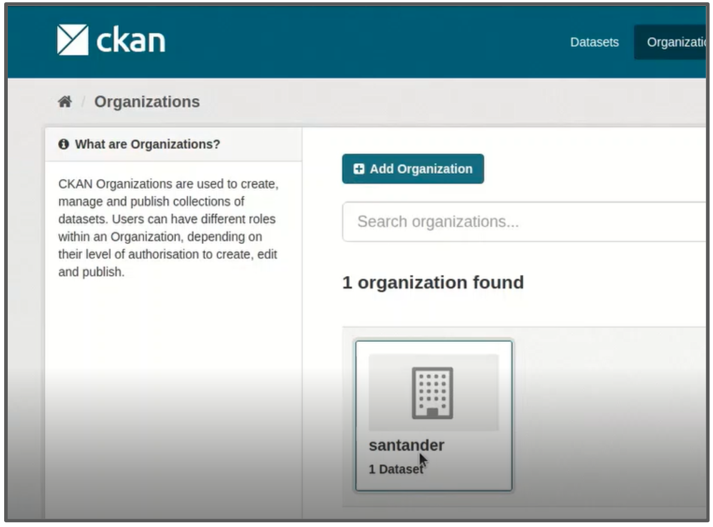
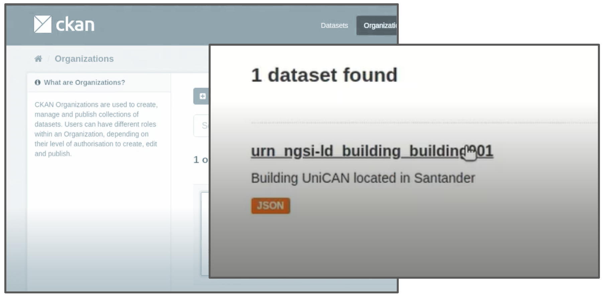

# Data and metadata publication into CKAN

This document presents a complete description of a use case using Draco for data and metadata publication into an Open Data portal, in this specific case using CKAN.
  

This guide was written in form of a quick start guide that overviews the steps a newbie programmer will have to follow to get familiar with Draco and its
basic functionality focused on providing the needed procedure for configuring and deploying the use cases presented. For more detailed information, please refer to the [README](index.md); the
[Installation and Administration Guide](./installation_and_administration_guide/introduction.md) and the
[Processors Catalogue](processors_catalogue/introduction.md) fully document Draco.

## Scenarios

This use case is composed of two scenarios:
-   Publish data and metadata into CKAN coming from NGSI-LD data sources (NGSI-DRACO-CKAN connector).
-   Publish data and metadata into CKAN coming from REST data sources (REST-DRACO-CKAN connector).

## Publish data and metadata into CKAN coming from NGSI-LD data sources (NGSI-DRACO-CKAN connector).
This scenario covers the configuration and deployment of the needed components for being able to capture transform and process data and metadata coming from
any NGSI-LD data sources (([Orion Context Broker](https://github.com/telefonicaid/fiware-orion),[Orion-LD Context Broker](https://github.com/FIWARE/context.Orion-LD),[Scorpio Broker](https://github.com/ScorpioBroker/ScorpioBroker) )
in order to be published into a CKAN portal complying with the [DCAT-AP v2.0.1](https://joinup.ec.europa.eu/collection/semantic-interoperability-community-semic/news/dcat-ap-release-201)  specification.
The main goal is allowing that a CKAN portal can be harvested by the European Data Portal not only complying with the DCAT-AP but also given the possibility to 
get a high Metadata Quality Score for the specific catalog or dataset published using this tool.


### Context

Currently, many smart cities around Europe are publishing the data coming for the IoT devices installed in that cities into open data portals like CKAN. However, this data 
is widely spread in terms of format of data and metadata. Due to this reason, the European Data Portal introduce the use of DCAT-AP in order to provide a way to standardize and measure the quality of the metadata of the open data portals that are harvested by the EDP.
 
In fact, CKAN has an API that allows publishing data coming from different data sources by the use of external tools that post 
data and metadata into it. However, many of these tools are not generic and usually are built for a specific use case. Additionally, many of the developed tools are difficult to be integrated with 
DCAT-AP to validate the metadata of the dataset or the catalog in CKAN. In order to fill these gaps, the NGSI-DRACO-CKAN connector was developed.

This scenario presents a use case of how this connector can be used for allowing publishing data and metadata coming from IoT devices into a CKAN Portal using the DCAT-AP. A graphical overview of the components used by this use case is shown in the next figure:


 
In this scenario, a real-time data source is considered. Usually, this data source is generated by IoT devices or sensors. This data is sent to 
[Orion-LD Context Broker](https://github.com/FIWARE/context.Orion-LD). As Orion, provide a publish subscriber mechanism Draco is able to get that data via subscribing.
Inside of Draco a set of processors are running to extract, transform and load the data for publishing it into a CKAN portal. Finally, due to the data and metadata is stored in CKAN
according to the EDP guidelines, it is easy to be harvested with a high metadata score.

### NGSI-DRACO-CKAN connector

The NGSI-DRACO-CKAN connector is a set of processors provided as a template inside of Draco for capturing NGSI events, adding DCAT-AP metadata to a NGSI event, and publishing the data and metadata into a CKAN Portal.

A graphical view of this template is presented in the next figure:



-   [ListenHTTP](../processors_catalogue/ngsi_rest_handler.md): it receives notifications from orion subscriptions.
-   [UpdateCKANMetadataAttributes](../processors_catalogue/upadate_ckan_metadata.md): configures metadata for organizations, packages, resources and datastores.
-   [NGSIToCKAN](../processors_catalogue/ngsi_ckan_sink.md):  creates organizations, packages, resources, datastores and views in CKAN.

For more details about the configuration of processors listed above, please go to the de documentation link provided. 

The first scenario presented in this guide is composed of the  following services:

-   Orion
-   Draco
-   CKAN 

<a name="section1"></a>

## Before starting

This document aims to provide an easy guide to set up FIWARE Draco and other containers for publishing data and metadata into CKAN.
In this guide, we will run a basic example of Draco for publishing data into CKAN.

All the scenario is running using docker containers. Thus, it is needed to have docker and docker-compose installed and running in your machine. Please, check
[this](https://docs.docker.com/linux/started/) official start guide.

This use case provides an example of how the user can publish data and metadata using the NGSI-DRACO-CKAN connector and other Generic enablers of the FIWARE ecosystem.
It emulates the creation of a dataset with the context data about a Building entity containing information about buildings, their coordinates, and the city that the building belongs to.

-   Building Entities that want to be published in a CKAN portal
-   Each Building is stored as a new package with a resource pointing to a Context Broker URL
-   Each Building belongs to a city 
-   Each city has its organization in the CKAN portal
Example:


The entity and subscription created in Orion for this use case are showed in the next figure:


An overview of the configuration used for the [UpdateCKANMetadataAttributes](../processors_catalogue/upadate_ckan_metadata.md) and [NGSIToCKAN](../processors_catalogue/ngsi_ckan_sink.md) processors are presented in the next figures respectively:




From this point, a step-by-step guide is going to be provided to replicate this use case. 

<a name="section2"></a>

## Getting an image

<a name="section2.1"></a>

### Building from sources

(1) Start by cloning the `fiware-Draco` repository:

```bash
git clone https://github.com/YourOpenDAta/open-data-connectors
cd open-data-connectors
```

And run the following command:

```bash
sudo ./up_all.sh
```

Once finished (it may take a while) the console will display the logs of each container.

(2) Once you have your containers up and running, you can add the template provided for persisting data and metadata into CKAN.

First, go to your browser and open Draco using this URL `http://localhost:9090/nifi`

The next image provides you with the location of many components of Draco. Please put special attention to the template
button, play button, and processor component, you will use them later.


Now go to the Components toolbar which is placed in the upper section of the NiFi GUI, find the template icon, and drag
and drop it inside the Draco user space. At this point, a popup should be displayed with a list of all the templates
available. Please select the template NGSI-DRACO-CKAN.

The NGSI-DRACO-CKAN template contains four processors. The first processor [ListenHTTP](../processors_catalogue/ngsi_rest_handler.md) opens a connection for getting NGSI-LD
notifications through the 5050 port. On the other hand, the second processor called ExtractJsonPath extracts data from the notification to generate the metadata
The third processor UpdateCKANMetadata is in charge to build metadata fields dynamically adapted to each entity. Finally, the four-processor NGSIToCKAN
takes the NGSI-LD events and persists that data and metadata into the CKAN creating the organization, package, resource, datastore, and view 
according to the received NGSI-LD event.



Before starting the processors, you need to set your CKAN API KEY  For
doing that please follow the instructions:

1.  Do right-click over the NGSIToCKAN processor inside of the Draco GUI userspace, and then click on configure.
Then, put the correct value to the properties, CKAN Host, CKAN Port and CKAN API KEY,according to your corresponding deployment.

2. Select all the processors (press shift and click on every processor) and start them by clicking on the start button.
    Now, you can see that the status icon of each processor turned from red to green.

3. Open a new terminal and run the `subscription.sh` script for creating the subscription to notify Draco:

```bash
chmod a+x subscription.sh
./scripts/yoda-use-cases/subscription.sh
```

Now to test your deployment, you may send an NGSI-like notification emulation to our listening port (5050) and path
(ld/notify):

4. Create entity UniCAN Building (urn:ngsi-ld:Building:Building001). Run the script unican.sh

```bash
chmod a+x unican.sh
./scripts/yoda-use-cases/unican.sh
```
You can check if the Organization and package and dataset have been created. First, enter CKAN GUI via browser to [http://localhost:5000].

-   The organization Santander will be created

-   The package urn_ngsi-ld_building_building001 will be created -> NGSIToCKAN processors generates the package name taken from the notification as it was not defined in the UpdateCKANMetadataAttributes

-   The resource UniCAN will be created


5. Download the catalog from CKAN. Go to the browser and put the following url:

```
https://{ckan-instance-host}/catalog.{format}?[page={page}]&[modified_since={date}]&[profiles={profile1},{profile2}]&[q={query}]&[fq={filter query}]
```
for example:

```
http://localhost:5000/dataset/urn_ngsi-ld_building_building003.rdf?profile=euro_dcat_ap,edp_dcat_ap
```
6. Using the maq-scoring and validation tool for get the scoring. Open a new terminal and clone the respository of the mqa-scoring tool:

```
https://github.com/YourOpenDAta/mqa-scoring.git
cd mqa-scoring
pip install -r requirements.txt
```

Use the mqa-scoring tool for getting the score of the rfd file that you got in the step 5:

```
python mqa-scoring.py -f ./downloads/urn_ngsi-ld_building_building003.rdf
```

Get the MQA score:


Now you can receive NGSI-LD notifications from Orion Context Broker and store the data and metadata into CKAN using Draco.

## Reporting issues and contact information

There are several channels suited for reporting issues and asking for doubts in general. Each one depends on the nature
of the question:

-   Use [stackoverflow.com](http://stackoverflow.com) for specific questions about this software. Typically, these will
    be related to installation problems, errors, and bugs. Development questions when forking the code are welcome as
    well. Use the `fiware-Draco` tag.
-   Use [ask.fiware.org](https://ask.fiware.org/questions/) for general questions about FIWARE, e.g. how many cities are
    using FIWARE, how can I join the accelerator program, etc. Even for general questions about this software, for
    instance, use cases or architectures you want to discuss.
-   Personal email:
    -   [joseandres.munoz@upm.es](mailto:joseandres.munoz@upm.es) **Main contributor**
    -   [jsalvachua@upm.es](mailto:jsalvachua@upm.es) **Contributor**

**NOTE**: Please try to avoid personally emailing the contributors unless they ask for it. In fact, if you send a private
email you will probably receive an automatic response enforcing you to use [stackoverflow.com](http://stackoverflow.com)
or [ask.fiware.org](https://ask.fiware.org/questions/). This is because using the mentioned methods will create a public
database of knowledge that can be useful for future users; private email is just private and cannot be shared.
